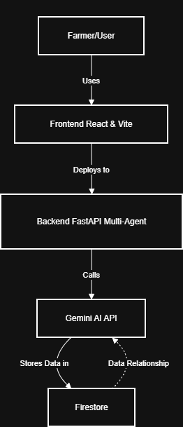

AgriSmart Brasil – Multi-Agent AI Platform for Smart Farming
🚀 Live Deployments
Frontend (React/Vite, Cloud Run):
https://agrismart-frontend-305905232437.southamerica-east1.run.app

Backend (FastAPI/Python, Multi-Agent, Cloud Run):
https://agrismart-backend-305905232437.southamerica-east1.run.app

API Documentation (Swagger/OpenAPI):
https://agrismart-backend-305905232437.southamerica-east1.run.app/api/docs

Public GitHub:
https://github.com/Vinisilva0010/agrismart-brasil

Video Demo:
<Your YouTube Video Link Here>

🏗️ Architecture Diagram

🌾 What is AgriSmart Brasil?
AgriSmart Brasil is a cloud-native multi-agent system built for Brazilian agriculture, powered by Google Gemini AI and Google Cloud Platform. Our solution helps farmers with crop management, climate analytics, crop disease detection, water optimization, and productivity forecasting—all delivered as an easy-to-use web app.

🔥 Key Features
Multi-Agent AI Core: Orchestrates 5+ specialized agents (climate, crop, yield, water, farm manager) through a robust FastAPI backend.

Google Gemini Integration: AI-powered analysis for chat, image diagnostics, and recommendations using Gemini APIs.

Modern User Interface: 100% React/Vite frontend for real farm dashboard experience, deployed on Cloud Run for scale and availability.

Smart Data Flow: (Optional) Uses Google Firestore to persist farm data and historical records.

Deployed and Documented: Live endpoints (see above) and full API docs for transparency and reproducibility.

🌎 Why Does It Matter?
Brazil is a world leader in agriculture, but many farmers lack AI-powered tools for integrated decision-making. AgriSmart fills this gap with:

AI chat for agricultural Q&A and scenario guidance

Automatic weather, yield, and disease analysis

A scalable, maintainable cloud-native architecture

⚡️ How It Works
User (Farmer) interacts via web browser

Frontend (React/Vite) displays dashboard and chat, sending requests to backend

Backend (FastAPI, multi-agent) handles user input, coordinates agents, and integrates with Google Gemini AI and (optionally) Firestore

Gemini AI API is used for natural language/chat and image recognition

Firestore (Optional): stores farm, crop, and analytical data

🛠️ Technologies Used
Frontend: React, Vite, JavaScript (Cloud Run)

Backend: Python, FastAPI, Google ADK, Multi-Agent design (Cloud Run)

AI: Google Gemini AI API (prompting for chat and image analysis)

Database (Optional): Google Firestore

Infrastructure: Google Cloud Run, GitHub Actions

Documentation: OpenAPI/Swagger

🚦 How To Run Locally
Frontend Setup:

text
cd frontend
npm install
VITE_BACKEND_URL=http://localhost:8080 npm run dev
Backend Setup:

text
cd backend
pip install -r requirements.txt
python -m api.main
The default local backend runs at http://localhost:8080 and the frontend at http://localhost:5173
You can update .env or modify the VITE_BACKEND_URL for your environment.

🤖 Main API Endpoints (see /api/docs for details)
POST /api/farm/query — Main agent chat endpoint

POST /api/climate/analyze — Weather and climate analysis

POST /api/crop/analyze-image — Crop disease/image analysis via Gemini

POST /api/water/irrigation-schedule — Water optimization

POST /api/yield/predict — Harvest/yield prediction

(Full documentation at /api/docs)

🏆 Google Cloud & AI Highlights
Full multi-service architecture deployed with Google Cloud Run

Multi-agent orchestrator implemented using Google ADK

Google Gemini AI API for advanced reasoning and crop image analysis

Optional Firestore NoSQL database for persistent analytics

🎥 Demo Video
Watch how AgriSmart Brasil empowers farmers with AI:

<Your YouTube Video Link Here>

📄 License
MIT License

🤝 Acknowledgements
Google Cloud Hackathon Team

Agrismart contributors

(Any relevant AI or open-source libraries)